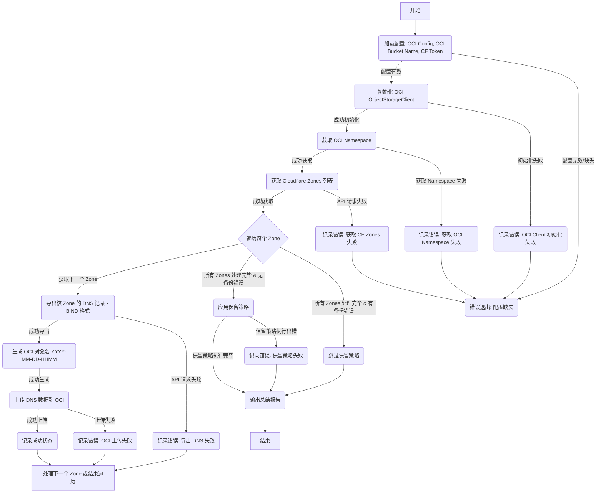

# Cloudflare DNS 备份至 OCI 对象存储脚本

本脚本用于自动将 Cloudflare 账户下的所有 DNS 区域记录备份到 Oracle Cloud Infrastructure (OCI) 对象存储，并应用灵活的多层保留策略。

## 功能特性

*   自动获取 Cloudflare 账户下的所有 DNS 区域。
*   导出每个区域的 DNS 记录为 BIND 格式。
*   将备份文件上传至指定的 OCI 对象存储 Bucket。
*   支持多种 OCI 认证方式：
    *   优先使用标准的 OCI 配置文件 (`~/.oci/config`)。
    *   自动回退尝试 Instance Principals (适用于 OCI Compute 实例环境)。
*   备份文件名包含精确到分钟的时间戳 (`YYYY-MM-DD-HHMM`)，确保每次运行生成唯一备份，避免覆盖。
*   实施灵活的保留策略，基于备份对象的实际创建时间 (`timeCreated`)：
    *   保留最近 7 天 (7 * 24 小时) 内的所有备份。
    *   保留超过 7 天但在最近 1 个月内的每周最新备份。
    *   保留超过 1 个月但在最近 1 年内的每月最新备份。
    *   永久保留超过 1 年的每年最新备份。
*   通过环境变量 (`.env` 文件) 进行安全配置。
*   详细的日志记录（输出到标准输出），方便追踪执行过程和排查问题。
*   处理常见的 Cloudflare API 和 OCI SDK 错误，例如认证失败、资源未找到、网络问题等，提高脚本健壮性。
*   自动处理 Cloudflare API 的分页，确保获取所有 Zones。

## 工作流程



## 安装依赖

确保您已安装 Python 3.x。然后通过 pip 安装所需的库：

```bash
pip install -r requirements.txt
```
(依赖库包括: `oci`, `python-dotenv`, `requests`)

## 配置

1.  **OCI 配置:**
    *   **推荐方式:** 配置好 Oracle Cloud Infrastructure CLI。脚本将默认使用位于 `~/.oci/config` 的配置文件和关联的密钥文件进行认证。
        *   **如何生成配置文件:** 登录 OCI 控制台，
            导航至您的用户设置   （或管理员身份导航至目标用户设置）。
            在“API 密钥”部分，选择“添加 API 密钥”。
            您可以选择让 OCI 为您 生成新的密钥对（推荐）或 上传您已有的公钥。
            生成新密钥时： 下载生成的 私钥 文件，并将其保存到您本地的 ~/.oci/ 目录下。请务必记录下保存的完整文件路径。
            获取配置信息： 无论生成还是上传，成功添加密钥后，控制台会显示一个 “配置文件预览” 片段。
        *   **权限要求:** 确保配置文件中指定的用户或 API 密钥拥有访问和管理目标对象存储 Bucket 的权限（至少需要 `OBJECT_CREATE`, `OBJECT_DELETE`, `OBJECT_READ`, `BUCKET_READ` 等权限）。
    *   **备选 (OCI 环境):** 如果脚本部署在 OCI Compute 实例上，您可以为该实例配置 Instance Principals。脚本在找不到本地配置文件时，会自动尝试使用 Instance Principals 进行认证。

2.  **环境变量:**
    *   将项目中的 `.env-example` 文件复制为 `.env`。
    *   编辑 `.env` 文件，填入以下必需的环境变量：
        *   `CLOUDFLARE_API_TOKEN`: 您的 Cloudflare API Token。**重要:** 此 Token 需要至少拥有 `Zone:Read` 和 `DNS:Read` 权限才能获取区域列表和导出 DNS 记录。您可以在 Cloudflare Dashboard -> My Profile -> API Tokens 创建。
        *   `OCI_BUCKET_NAME`: 您在 OCI 对象存储中预先创建好的、用于存放 DNS 备份文件的 Bucket 名称。

## 使用方法

### 手动运行

在配置好 OCI 环境和 `.env` 文件后，可以直接运行脚本：

```bash
python cloudflare_oci_backup.py
```

### 定期执行 (Cron 示例)

您可以使用 cron 或类似的计划任务工具来定期自动执行备份。以下是一个 cron 任务示例，设置为每天凌晨 2:30 执行：

```cron
# 每天凌晨 2:30 执行 Cloudflare DNS 备份
30 2 * * * cd /path/to/your/script/directory && /path/to/your/python3 cloudflare_oci_backup.py >> /path/to/your/cron_backup.log 2>&1
```

**请务必:**
*   将 `/path/to/your/script/directory` 替换为脚本所在的**实际绝对路径**。
*   将 `/path/to/your/python3` 替换为您环境中 **Python 3 解释器的绝对路径** (可以使用 `which python3` 命令查找)。
*   将 `/path/to/your/cron_backup.log` 替换为您希望**存储日志文件的路径**。`>>` 表示追加日志，`2>&1` 表示将错误输出也重定向到日志文件。

## 保留策略详解

脚本在成功完成所有区域的备份后（即备份阶段没有发生错误），会自动执行清理操作，应用以下保留策略：

1.  **最近 7 天:** 保留过去 7 * 24 小时内创建的所有备份对象。
2.  **每周最后一个:** 对于超过 7 天但在最近 1 个月（按 31 天计）内的备份，保留每个日历周（ISO week date）内**时间戳最新**（最晚创建）的那个备份。
3.  **每月最后一个:** 对于超过 1 个月但在最近 1 年（按 365 天计）内的备份，保留每个日历月内**时间戳最新**的那个备份。
4.  **每年最后一个:** 对于超过 1 年的备份，保留每个日历年内**时间戳最新**的那个备份。

**注意:**
*   保留策略的判断基于 OCI 对象存储中对象的 `timeCreated` 元数据（UTC 时间）。
*   如果备份过程中任何一个区域失败，出于安全考虑，**不会**执行保留策略和删除操作。
*   删除操作在交互式终端中会请求用户确认（输入 'yes'），在非交互式环境（如 cron）中会自动执行。

## 日志

脚本执行过程中的所有信息、警告和错误都会通过 Python 的 `logging` 模块输出到**标准输出 (stdout)**。
当使用 cron 或其他方式重定向输出时，可以将日志记录到文件中。日志格式包含时间戳、日志级别和消息内容。

## 贡献与支持

欢迎提出改进建议或报告问题。请通过 GitHub Issues 进行。

## 许可证

本项目采用 MIT 许可证